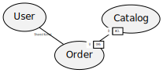
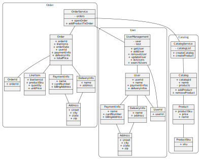

# Domain Model Design Tools

A simple tool to generate Context Map and Domain Model with Java annotation.

## Introduction

As an architect, I found myself wasted a lot of time drawing and updating diagrams.
DSL like plantuml works good enough for simple diagrams however

1. it is difficult to control the layout of the diagram.
   Tricks like hidden link and clear understanding of the ranking of each component would help,
   but when the diagram grew large, it's close to impossible to keep track of things.
1. it is difficult to maintain the diagram.
   Upgrading the diagram often quite labor intensive, mostly because it's just a giant file with many components.
   It could be modularized by using include, but that requires hosting those include files somewhere.
   
## Why Java Annotation

Java is supported by most common IDE, refactoring your domain objects could be done easily.
Using annotation also help us separate the code for the data structure from the code describing their relationship. 

## Usage

### Context Map

All context map annotation are done on the package level.

Each package represents a bounded context is annotated with `@BoundedContext("<name>")`.
The relationship between the bounded context is annotated with the name of the pattern used, `@AntiCorruptionLayer`, `@Conformist`, `@CustomerSupplier`, `@OpenHostService`, or `@SharedKernel`.
All of them take a parameter, `value`, as the full package name of the other bounded context.
`@CustomerSupplier` takes an extra parameter indicting if the bounded context is an upstream or downstream relationship.

### Example



#### TODO

* difficult color for external bounded context
* add Published Language
* implement team map

### Domain Model

Domain Model are annotated at the class level.
Classes can be annotated as `@AggregatedRoot`, `@DomainService`, `@Entity`and `@ValueObject`.
These annotations are shown on the generated domain model with different color and provide checks to make sure it didn't violate any DDD rules.
Example rules would be making sure `@Entity` has an `@Id` while `@ValueObject` doesn't.
`@Event` indicates if a function references object in another bounded context.
It will also make sure it can only reference an `@AggregatedRoot`.

### Example



#### TODO

* implement more DDD rule checks
* implement multiplicity

## Maven

To use it with maven, create a commandline springboot application with all your domain objects, add `com.youramaryllis:ddd-generator` to the dependency

```
<dependency>
  <groupId>com.youramaryllis</groupId>
  <artifactId>ddd-generator</artifactId>
  <version>1.2.0</version>
</dependency>
```

The spring bean will auto configure and inspect the classes specified in the parameter `ddd-generator.packageName` and generate the context map and domain model diagrams.


